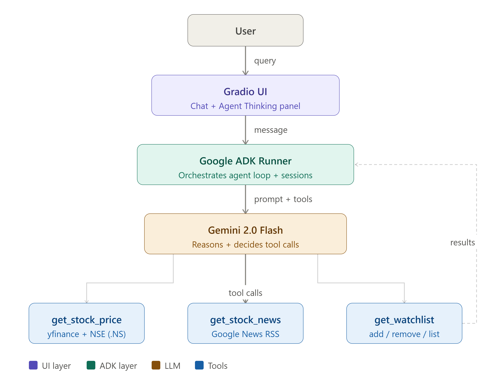
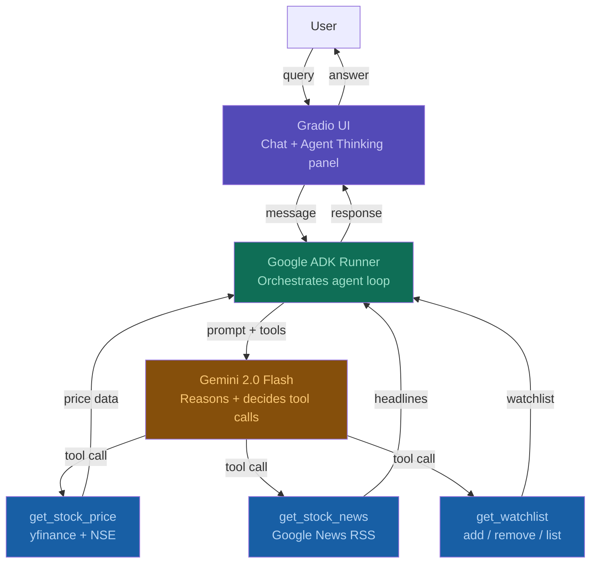

# Nivesh — Your Indian Equity Concierge
> A personal AI agent for Indian retail investors built with
> Google ADK + Gemini 2.0 Flash

## Disclaimer
Nivesh is a demonstration project. It does not provide financial advice. Always consult a SEBI-registered advisor before making investment decisions.

## The Problem
Modern Indian retail investors are flooded with news headlines, technical charts, and social media speculation across numerous platforms. This sheer volume of unfiltered data frequently leads to decision fatigue rather than confident decision-making. Investors do not need more raw feeds; they need clear, reasoned, and contextual answers regarding their specific stocks to navigate the markets efficiently.

## The Solution
Nivesh acts as a direct, data-driven personal equity concierge that filters out the noise. By combining real-time NSE price feeds with recent financial news, it reasons across the investor's current watchlist before formulating a response. Nivesh answers user queries like a personal equity research analyst rather than a generic search engine, giving investors clarity on their portfolio at a glance.

## Architecture

## Architecture



The agent loop:
1. User sends a query via Gradio chat interface
2. Google ADK Runner orchestrates the session
3. Gemini 2.0 Flash decides which tools to call
4. Tools fetch real data (prices via yfinance, news via Google News RSS, watchlist from session memory)
5. Gemini synthesizes a reasoned, personalized response
6. Agent Thinking panel shows every tool call with timing

## Agent Capabilities
| Tool | Description |
|---|---|
| get_stock_price | Live NSE price via yfinance (.NS suffix) |
| get_stock_news | Top 3 headlines via Google News RSS |
| get_watchlist | Returns user's current watchlist |
| add_to_watchlist | Adds a stock (explicit user command only) |
| remove_from_watchlist | Removes a stock from watchlist |

## Example Queries
- "What is RELIANCE trading at right now?"
- "Should I be worried about my portfolio today?"
- "Add BAJAJFINSV to my watchlist"
- "Latest news on TCS"
- "How is my watchlist performing?"

## Tech Stack
- Google ADK (agent framework)
- Gemini 2.0 Flash (LLM)
- agents-cli (scaffolding + project tooling)
- Gradio (UI)
- yfinance (live NSE stock prices)
- Google News RSS (recent headlines)
- Antigravity IDE (vibe coding environment)

## Quick Start
```bash
git clone https://github.com/TYogesh12/Nivesh
cd Nivesh
cp .env.example .env
# Add your GOOGLE_API_KEY to .env
uv sync
uv run python app.py
```

## Course Concepts Demonstrated
- Agent system with Google ADK
- Tool use and function calling
- Session memory with InMemorySessionService
- Security via explicit tool call restrictions in docstrings
- Built with agents-cli and Antigravity IDE
